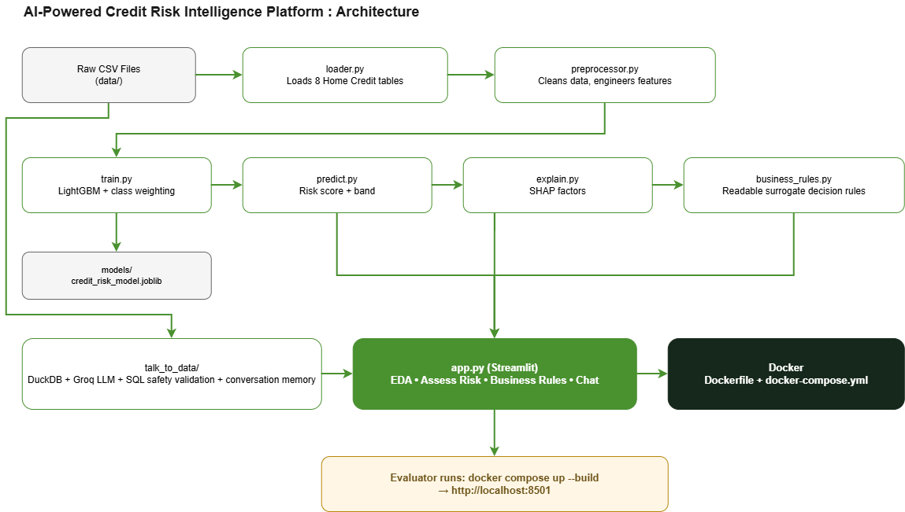

# AI-Powered Credit Risk Intelligence Platform

A credit risk scoring platform built on the Home Credit Default Risk
dataset. Includes data analysis, a trained risk model, model
explainability, simplified business rules, a talk-to-data chatbot, and
a deployable app - all running as a single Docker container.

## Quick Start (Docker - Recommended)

```bash
git clone <this-repo-url>
cd credit_risk_platform
```

1. Place the Home Credit CSV files in `data/` (not committed - see `.gitignore`)
2. Copy `.env.example` to `.env` and add a free Groq API key (https://console.groq.com/keys)
3. Run:
```bash
docker compose up --build
```
4. Open http://localhost:8501

The model, EDA charts, and business rules work immediately - model
artifacts are committed to the repo. The Chat tab needs the CSVs from
step 1 and the API key from step 2.

## Alternative: Run Without Docker

```bash
python -m venv venv
venv\Scripts\Activate.ps1        # Windows
# source venv/bin/activate       # Mac/Linux
pip install -r requirements.txt
streamlit run app.py
```

## Project Structure

```
credit_risk_platform/
├── data/                   # Raw CSV files (not committed)
├── notebooks/
│   ├── eda.ipynb           # Exploratory data analysis
│   └── eda.py              # Same analysis, as a plain script
├── src/
│   ├── data/
│   │   ├── loader.py       # Loads all 8 Home Credit tables
│   │   └── preprocessor.py # Cleans data and builds features
│   ├── ml/
│   │   ├── train.py           # Trains and saves the model
│   │   ├── evaluate.py        # Reports ROC-AUC, PR-AUC, precision/recall
│   │   ├── predict.py         # Scores a single applicant
│   │   ├── explain.py         # SHAP-based per-prediction explanations
│   │   ├── business_rules.py  # Simplified decision-tree surrogate
│   │   └── compare_models.py  # Class weighting comparison experiment
│   └── talk_to_data/
│       ├── query_runner.py      # DuckDB + SQL safety validation
│       ├── prompt_templates.py  # Schema-grounded prompts
│       └── nl_to_sql.py         # Question -> SQL -> answer, with memory
├── models/                 # Saved model + metadata (raw dataset excluded)
├── outputs/                # Run logs, charts, rule outputs
├── documents/               # Architecture diagram, final presentation PDF
├── app.py                  # Streamlit UI
├── Dockerfile
├── docker-compose.yml
└── requirements.txt
```

## Architecture Overview



Two independent pipelines share the same raw data source and converge
in the Streamlit app:
- **ML pipeline**: `preprocessor.py` cleans and engineers features,
  `train.py` produces the model, `predict.py`/`explain.py`/
  `business_rules.py` all consume it for scoring, explanation, and
  simplified rules.
- **Talk-to-data pipeline**: reads the raw CSVs directly into DuckDB,
  completely independent of the ML model - the chatbot never touches
  `credit_risk_model.joblib`.

Both feed into `app.py`, which is what gets containerized and deployed.

## 1. Exploratory Data Analysis

Full analysis: `notebooks/eda.ipynb`. Covers dataset overview, target
imbalance, data quality, feature categorization, univariate/bivariate
analysis, financial risk ratios, correlation analysis, and credit
history/repayment behaviour from the supplementary tables.

**Key findings:**
- Default rate: 8.07% (highly imbalanced) - accuracy is not a usable
  metric; ROC-AUC and PR-AUC used instead
- Strongest predictors: EXT_SOURCE_1/2/3 (external credit scores), age,
  employment duration
- Applicants with no bureau history default *more* often than those
  with some history (the "thin file" effect)
- A history of late payments predicts higher default risk on the
  current loan
- Two data quality issues found and fixed: a placeholder value in
  DAYS_EMPLOYED (365243, ~18% of rows, 99.96% Pensioners) and a single
  income entry error (117,000,000)

## 2. Data Pipeline

`src/data/loader.py` loads all 8 Home Credit tables and documents how
they join via `SK_ID_CURR` / `SK_ID_BUREAU` / `SK_ID_PREV`.

`src/data/preprocessor.py`:
- **Cleaning**: fixes the DAYS_EMPLOYED anomaly, caps the income
  outlier at the 99.5th percentile, drops the negligible-sample
  CODE_GENDER "XNA" rows, drops columns above 50% missing
- **Feature engineering**: builds AGE_YEARS, EMPLOYMENT_YEARS,
  CREDIT_INCOME_RATIO, ANNUITY_INCOME_RATIO, and aggregates
  bureau.csv / previous_application.csv / installments_payments.csv
  from many-rows-per-applicant down to one row per applicant

Final feature matrix: 307,507 applicants x 97 columns. Remaining
missing values are left as-is - LightGBM handles missing values
natively during split selection.

## 3. Model Selection & Class Imbalance Strategy

**Algorithm:** LightGBM (gradient-boosted trees) - chosen for native
handling of categorical features and missing values, and strong
baseline performance on tabular credit risk data.

**Class imbalance:** `class_weight="balanced"`, chosen over SMOTE to
avoid generating synthetic applicants from a feature set with many
categorical and engineered columns.

**Validation:** stratified 80/20 split of `application_train.csv`
(`application_test.csv` has no TARGET label and cannot be used for
evaluation).

### Evaluation Metrics & Results

| Metric | Score |
|---|---|
| ROC-AUC | 0.7657 |
| PR-AUC | 0.2562 |
| Precision | 0.1804 |
| Recall | 0.6483 |
| F1 Score | 0.2822 |

### Class Weighting: Evidence-Based Comparison

Two identical models were trained on the same data and validation
split, differing only in class weighting:

| Metric | No Weighting | class_weight="balanced" |
|---|---|---|
| ROC-AUC | 0.7656 | 0.7657 |
| PR-AUC | 0.2578 | 0.2562 |
| Precision | 0.5749 | 0.1804 |
| Recall | 0.0286 | 0.6483 |
| F1 Score | 0.0545 | 0.2822 |

Without weighting, the model catches only 2.9% of actual defaulters
despite higher precision - it plays it safe and rarely predicts
default at all. ROC-AUC and PR-AUC stay nearly identical between the
two versions, confirming both models learned a similar underlying risk
ranking; class weighting changes where the decision threshold sits,
not the model's ability to distinguish risk. Given the higher business
cost of missing an actual defaulter versus over-flagging a safe
applicant for review, `class_weight="balanced"` was retained as the
final choice. Full comparison script: `src/ml/compare_models.py`.

### Scoring a New Applicant

`src/ml/predict.py` takes a single applicant's details (a Python
dictionary, using the same field names as `application_train.csv`)
and returns a default probability, a risk score out of 100, and a
risk band (Low / Medium / High):

| Band | Probability |
|---|---|
| Low | below 10% |
| Medium | 10% - 30% |
| High | 30% and above |

A new applicant won't have every one of the 97 model features (e.g. no
prior bureau/installment history for a first-time applicant). Missing
fields are filled the same way "no history" was handled during
training - 0 for count-based fields, left as NaN otherwise. The output
reports exactly how many fields were provided versus defaulted, so
this is transparent rather than hidden.

## 4. Explainability

`src/ml/explain.py` uses SHAP (TreeExplainer) to explain individual
predictions - which features pushed the risk score up or down, and by
how much, in plain language.

Two deliberate exclusions from the displayed explanation:
- Fields the applicant didn't provide a real value for (LightGBM can
  treat missingness as informative, but "this increased your risk
  (value: unknown)" isn't a useful explanation for a human reader)
- Protected/sensitive attributes (gender, marital status) - the model
  may use them internally, but showing them as a "reason" for a credit
  decision is a fair-lending concern regardless of what SHAP
  calculated mathematically

## 5. Rule Derivation Logic & Sample Outputs

`src/ml/business_rules.py` trains a shallow decision tree (max depth
3) to approximate the real LightGBM model's predictions - a
"surrogate model" simple enough for a non-technical credit policy team
to review and understand. It is trained on the real model's binary
predictions at the default 0.5 threshold (not the full probability
ranking), and it is not a replacement for the actual scoring model.

Protected attributes and raw day-count columns (superseded by their
readable year-based versions) are excluded from the surrogate, same
reasoning as the SHAP explanations.

**Sample output** (`outputs/business_rules_structured.json`):
```
IF External Credit Score 3 <= 0.44 AND External Credit Score 2 <= 0.49
   AND External Credit Score 3 <= 0.33
-> HIGH RISK (90% confidence, 16,159 training applicants)

IF External Credit Score 3 > 0.44 AND External Credit Score 2 > 0.40
   AND External Credit Score 2 > 0.55
-> LOW RISK (97% confidence, 73,045 training applicants)
```

Agreement with the real model on validation data: **81.6%** - disclosed
honestly rather than presenting the simplified rules as equivalent to
the real model. The resulting rules confirm what EDA and SHAP both
found throughout this project: the external credit scores dominate the
decision.

## 6. Talk-to-Data Chatbot

Three files, matching the required structure:
- `src/talk_to_data/query_runner.py` - loads 4 tables (applications,
  bureau, previous_applications, installments) into a cached DuckDB
  connection, validates and executes SQL safely
- `src/talk_to_data/prompt_templates.py` - the schema-grounded system
  prompt, including column meanings, join keys, and data semantics
  (e.g. TARGET=1 means default, DAYS_BIRTH is negative)
- `src/talk_to_data/nl_to_sql.py` - question -> SQL -> answer, using
  Groq's free API (`openai/gpt-oss-120b`), with conversation memory
  for follow-up questions

### SQL Safety Validation (Hallucination Control)

Only SELECT (or WITH...SELECT) statements are allowed; any query
containing a destructive keyword (DROP, DELETE, UPDATE, INSERT, ALTER,
etc.) is rejected before it reaches the database; statement-stacking
(multiple queries separated by `;`) is blocked; results are capped at
20 rows; one retry is attempted with the error fed back to the model
if the first SQL attempt fails validation.

### Prompt Engineering & Token Optimization

- The schema shown to the LLM is limited to ~20 relevant columns per
  table (not all 122 raw application columns)
- Both the DuckDB connection and the schema summary are cached at
  module level rather than rebuilt on every question
- Two separate, focused LLM calls are used (one for SQL generation,
  one for answer generation) rather than one large combined prompt
- Conversation memory is capped at the last 3 exchanges, so token
  usage doesn't grow unboundedly over a long conversation

### Conversation Memory

Follow-up questions are resolved using recent conversation history
(e.g. asking "What about non-defaulters?" after "What is the average
income of applicants who defaulted?" correctly returns the TARGET=0
figure, with no explicit restatement of the original question).

### 5 Example Queries (Tested and Working)

1. Average income of applicants who defaulted vs. didn't
2. Applicants with more than 2 previously refused applications
3. Default rate for self-employed applicants
4. Percentage of applicants above age 50
5. Average credit amount by education level

Query 3 demonstrates hallucination control directly: "self-employed"
isn't an actual category in this dataset. Rather than inventing a
plausible-sounding but fake percentage, the system honestly reports
that no matching applicants were found. A related example shows the
same discernment in both directions: "How did you manage the class
imbalance?" (a methodology question, not answerable from the data)
correctly returns "This question can't be answered with the data
available in this database," while the related but data-answerable
"class imbalance?" correctly returns the actual 92%/8% split.

Run `python src/talk_to_data/nl_to_sql.py` for an interactive prompt,
or `python src/talk_to_data/nl_to_sql.py --demo` to re-run the 5
example queries above.

## 7. User Interface

`app.py` (Streamlit) unifies every module into one app, with a left
navigation rail:

- **Home** - overview, key stats, and a summary of each section
- **EDA** - charts grouped into collapsible categories with per-section
  takeaways, plus headline KPI cards
- **Assess Risk** - a form collecting applicant details (external
  credit scores optional), with input validation, showing the risk
  score, band, and SHAP explanation together in one view
- **Business Rules** - the simplified decision tree shown as readable
  colored cards (not raw tree text), with per-rule confidence and
  sample size, plus the real model's overall agreement percentage
- **Chat** - the talk-to-data chatbot, with clickable example
  questions, conversation memory, and a scrollable message history

Custom styling throughout: a consistent brand palette, inline SVG
icons (not emoji, for consistent cross-platform rendering), and a
Responsible AI disclaimer shown with every prediction.

## 8. Docker Deployment

```bash
docker compose up --build
```

Then open http://localhost:8501.

**Included in the image:** all code and the trained model artifacts
(`models/credit_risk_model.joblib` and its metadata) - committed to
the repo (unlike the raw dataset) so the EDA, Assess Risk, and
Business Rules tabs work immediately with no setup.

**Mounted at runtime, not baked into the image:**
- `data/` - the raw CSVs, required only for the Chat tab (DuckDB reads
  them directly). Not committed to git per the assignment's instructions.

**Environment variables:** copy `.env.example` to `.env` and add a
free Groq API key for the Chat tab to work.

Verified working end-to-end: all pages tested successfully running
inside the container.

## Known Limitations & Possible Improvements

- `application_test.csv` is not used for evaluation, since it has no
  TARGET label - a stratified split of `application_train.csv` is
  used instead
- `class_weight="balanced"` favors recall over precision (see the
  comparison table above) - a deliberate, documented trade-off, not
  an oversight
- The business rules surrogate is a simplification (81.6% agreement
  with the real model), not a substitute for it
- Protected/sensitive attributes (gender, marital status) are excluded
  from the displayed explanations and business rules, though the
  underlying model may still use them internally - a full fair-lending
  audit is outside this assignment's scope
- Bureau/previous application/installment features assume the
  aggregated historical records represent information available
  before the current application's decision point
- Streamlit's rerun-per-interaction model doesn't scale to many
  concurrent users - a real production deployment would expose this
  same model through a FastAPI backend behind a proper frontend, add
  authentication, drift monitoring, and adverse-action-notice
  generation for regulatory compliance